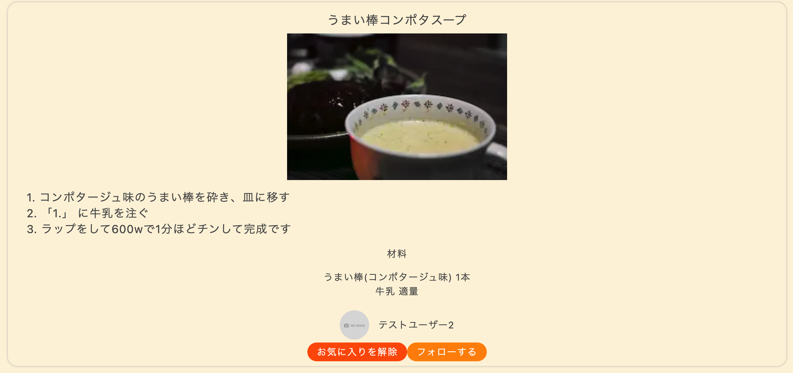

# recipes-front-with-pageDir

簡単なレシピアプリを作ってみました。フロントエンドはNextjs、バックエンドはRuby on RailsのAPIモードで開発しました。

# 主な機能
- レシピの閲覧(ユーザー登録しなくても可)
- レシピ投稿(ユーザー登録必須)、レシピ削除(投稿した本人だけが削除可能で、第三者からレシピを削除はできません)機能
- お気に入り登録機能(ユーザー登録必須)
- フォロー機能(ユーザー登録必須)

## 使用した技術
- フロントエンド
    - Nextjs(Pagesディレクトリ)
    - StoryBook(インタラクションテストも行ってみました)
    - React Hook Form
    - zod
    - axios
    - js-cookie
- バックエンド
    - Ruby on Rails
    - Active Storage

# ER図

# 主な使い方

## 1. トップページでレシピ一覧を見る。

## 2. 気になったレシピがあったら、そのレシピの箇所をクリックすると、詳しい作り方が書いてある詳細ページへ飛びます。

## 3. 以下はユーザー登録、ログインをすることで、使える機能を紹介します。

以下のようなユーザー登録画面です

## 4. レシピを投稿する

- 実際のレシピ投稿画面です

## 5. 興味のあるレシピをトップページで「保存」ボタンを押すことでお気に入り登録できます。正常に保存されれば、今度は「お気に入りを解除」と表示されます。

「保存」ボタンを押した後、トップページの「保存済みレシピを見る」を押すと、保存したレシピの一覧が見ることができます。

## 6. フォロー機能も使える。5.と同様にトップページでフォローしたいユーザーがいれば「フォローする」ボタンを押す。そのリクエストがうまくいけば、「フォローを解除」と表示される。

### 「フォローする」ボタンを押した後、トップページの「フォローしている人を見る」を押すと、フォローしている人を見られます。

ちなみに、もちろんフォロワーも見ることができます

## 7. レシピの削除(そのレシピを投稿した本人のみ削除が可能です)

### 以下の画像を見ると、削除ボタンが表示されていることがわかると思います。このボタンを押すと、そのレシピを削除できます

## 挑戦してみたこと

- StoryBookの導入
今回はStoryBookを使用してみたのですが、サーバー側を待たずにUIを確認できるのは非常に助かりました。また、コンポーネント単体で確認できるので、ページに組み込んだ後に修正するということが減りました。

- 画像を表示するのに通常のHTMLのimgタグではなく、NextjsのImageコンポーネントを使用ました。Imageコンポーネントを使うことで画像の最適化が行われるので、Webページの表示速度が上がることにつながります。さらに、自動で遅延読み込みしてくれるそうです。

### 余談
画像を表示する際、NextjsのImageコンポーネントを使って、画像最適化していると説明しましたが、実際どの程度ファイルサイズが変化してみるか確認してみると、通常のHTMLのimgタグを使うのとではかなり違っており、具体的には1.9MBだったものが9.2KBへとなっていたので、驚きました。積極的に使っていきたいと思います。

## 通常のHTMLのimgタグの場合

##　NextjsのImageコンポーネントの場合
